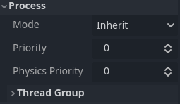
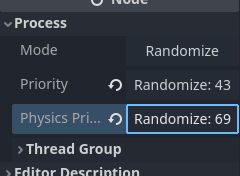

<!--
  ~ Copyright (c) godot-rust; Bromeon and contributors.
  ~ This Source Code Form is subject to the terms of the Mozilla Public
  ~ License, v. 2.0. If a copy of the MPL was not distributed with this
  ~ file, You can obtain one at https://mozilla.org/MPL/2.0/.
-->

# 检查器插件

检查器面板允许您通过插件，创建自定义控件来编辑属性。

这在处理自定义数据类型和resources时非常有用，尽管您也可以使用此功能来更改内置类型的检查器控件。
您可以为特定属性、整个对象，甚至与特定数据类型关联的独立控件设计自定义控件。

更多信息，请参见 [docs.godotengine.org](https://docs.godotengine.org/en/stable/classes/class_editorinspectorplugin.html#class-editorinspectorplugin)。

Godot文档中的[示例](https://docs.godotengine.org/en/stable/tutorials/plugins/editor/inspector_plugins.html)，该示例会将整数输入替换为一个按键，该按键生成一个随机值。


The [example](https://docs.godotengine.org/en/stable/tutorials/plugins/editor/inspector_plugins.html)


之前（整数输入）：



之后（按键）：



在终端中与 `Cargo.toml` 相同目录下添加此依赖：

```bash
cargo add rand
```

创建 `addon.rs` 文件并在 `lib.rs` 中导入它：

```rust
// file: lib.rs
mod addon;
```

在文件开头添加以下导入：

```rust
use godot::classes::{
    Button, EditorInspectorPlugin, EditorPlugin, EditorProperty, IEditorInspectorPlugin,
    IEditorPlugin, IEditorProperty,
};
use godot::global;
use godot::prelude::*;
use rand::Rng;
```

Since Rust is a statically typed language, we will proceed in reverse order unlike in Godot documentation, to avoid encountering errors unnecessarily.


## 添加属性编辑器

To begin with, let's define the editor for properties:

```rust
#[derive(GodotClass)]
#[class(tool, init, base=EditorProperty)]
struct RandomIntEditor {
    base: Base<EditorProperty>,
    button: Option<Gd<Button>>,
}
```

After that, we need to add an implementation for the trait `IEditorProperty`:

```rust
#[godot_api]
impl IEditorProperty for RandomIntEditor {
    fn enter_tree(&mut self) {
        // Create button element.
        let mut button = Button::new_alloc();

        // Add handler for this button, handle_press will be define in another impl.
        button.connect("pressed", self.base().callable("handle_press"));
        button.set_text("Randomize");

        // Save pointer to the button into struct.
        self.button = Some(button.clone());
        self.base_mut().add_child(button.upcast());
    }

    fn exit_tree(&mut self) {
        // Remove element from inspector when this plugin unmount:
        if let Some(button) = self.button.take() {
            self.base_mut().remove_child(button.upcast());
        } else {
            // Log error if button disappeared before
            godot_error!("Button wasn't found in exit_tree");
        }
    }
}
```

Let's add a handler for the button:

```rust
#[godot_api]
impl RandomIntEditor {
    #[func]
    fn handle_press(&mut self) {
        // Update value by button click:
        // - Take property name, randomize number.
        // - Send property name and random number to Godot engine to update value.
        // - Update button text.
        let property_name = self.base().get_edited_property();
        let num = rand::thread_rng().gen_range(0..100);

        godot_print!("Randomize! {num} for {property_name}");

        self.base_mut()
            .emit_changed(property_name, num.to_variant());

        if let Some(mut button) = self.button.clone() {
            let text = format!("Randomize: {num}");
            button.set_text(&text);
        } else {
            // Print error of something went wrong
            godot_error!("Button wasn't found in handle_press");
        }
    }
}
```


## 添加检查器插件

Now we need to connect this editor to fields with an integer type.
To do this, we need to create an `EditorInspectorPlugin`.

```rust
#[derive(GodotClass)]
#[class(tool, init, base=EditorInspectorPlugin)]
struct RandomInspectorPlugin {
    base: Base<EditorInspectorPlugin>,
}
```

To add a property editor (which we implemented earlier), you need to implement the `IEditorInspectorPlugin` trait:

```rust
#[godot_api]
impl IEditorInspectorPlugin for RandomInspectorPlugin {
      fn parse_property(
        &mut self,
        _object: Gd<Object>, // object that is being inspected
        value_type: VariantType,
        name: GString,
        _hint_type: global::PropertyHint,
        _hit_string: GString,
        _flags: global::PropertyUsageFlags,
        _wide: bool,
    ) -> bool {
        if value_type == VariantType::INT {
            self.base_mut()
                .add_property_editor(name, RandomIntEditor::new_alloc().upcast());
            return true;
        }

        false
    }

    // This method says Godot that this plugin handle the object if it returns true
    fn can_handle(&self, object: Gd<Object>) -> bool {
        // This plugin handle only Node2D and object that extends it
        object.is_class("Node2D")
    }
}
```

If `parse_property` returns `true`, the editor plugin will be created and replace the current
representation; if not, it's necessary to return `false`.
This allows you to control where and how processing is done by this plugin.


## 添加编辑器插件

Only one thing left to do: define the editor plugin that will kick off all this magic!
This can be a generic `EditorPlugin` or a more specific `InspectorEditorPlugin`, depending
on what you want to achieve.


```rust
#[derive(GodotClass)]
#[class(tool, init, editor_plugin, base=EditorPlugin)]
struct RustEditorPlugin {
    base: Base<EditorPlugin>,
    random_inspector: Gd<RandomInspectorPlugin>,
}
```

```rust
#[godot_api]
impl IEditorPlugin for RustEditorPlugin {
    fn enter_tree(&mut self) {
        // Create our inspector plugin and save it.
        let plugin = RandomInspectorPlugin::new_gd();
        self.random_inspector = plugin.clone();
        self.base_mut().add_inspector_plugin(plugin.upcast());
    }

    fn exit_tree(&mut self) {
        // Remove inspector plugin when editor plugin leaves scene tree.
        let plugin = self.random_inspector.clone();
        self.base_mut().remove_inspector_plugin(plugin.upcast());
    }
}
```


```admonish note title="Troubleshooting"
Sometimes after compilation, you may encounter errors or panic. Most likely, all you need to do is simply **restart** the Godot Editor.
```

Example error:

```log
Initialize godot-rust (API v4.2.stable.official, runtime v4.2.2.stable.official)
ERROR: Cannot get class 'RandomInspectorPlugin'.
   at: (core/object/class_db.cpp:392)
ERROR: Cannot get class 'RandomInspectorPlugin'.
   at: (core/object/class_db.cpp:392)
```
