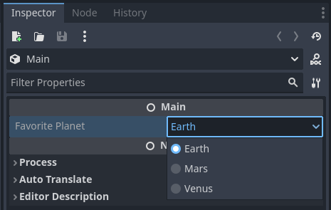

<!--
  ~ Copyright (c) godot-rust; Bromeon and contributors.
  ~ This Source Code Form is subject to the terms of the Mozilla Public
  ~ License, v. 2.0. If a copy of the MPL was not distributed with this
  ~ file, You can obtain one at https://mozilla.org/MPL/2.0/.
-->

# 注册属性

到目前为止，你已经学会了如何注册类和函数。这样就足以用 godot-rust 创建简单的应用程序了，但你可能希望让 Godot 能更直接地访问你对象的状态。

这时，属性就派上用场了。在 Rust 中，属性通常定义为结构体的字段。

另请参考 [GDScript属性参考][godot-gdscript-properties].


## 目录

<!-- toc -->


## 注册变量

之前，我们定义了一个函数 `Monster::get_name()`，它可以用来获取名称，但在 GDScript 中使用时仍然需要写 `obj.get_name()`。有时候，你不需要额外的封装，而是希望直接访问字段。

godot-rust库提供了 `#[var]` 属性来标记应当暴露为变量的字段。它的功能类似于 GDScript 中的 `var` 关键字。

从之前的结构体声明开始，我们现在将 `#[var]` 属性添加到 `name` 字段上。同时，我们将类型从 `String` 改为 `GString`，因为该字段现在直接与 Godot 交互。

```rust
#[derive(GodotClass)]
#[class(init, base=Node3D)]
struct Monster {
    #[var]
    name: GString,
    hitpoints: i32,
}
```

这样做的效果是，`name` 现在作为 _属性_ 在 Godot 中注册：

```GDScript
var monster = Monster.new()

# Write the property.
monster.name = "Orc"

# Read the property.
print(monster.name) # prints "Orc"
```

在 GDScript 中，属性是对 getter 和 setter 函数调用的语法糖。你也可以显式调用这些函数：


```GDScript
var monster = Monster.new()

# Write the property.
monster.set_name("Orc")

# Read the property.
print(monster.get_name()) # prints "Orc"
```

`#[var]`属性还可以接受参数，用来定制是否同时提供 getter 和 setter，以及它们的名称。如果你需要更复杂的逻辑，也可以编写 Rust 方法作为 getter 和 setter。详情请参阅[API 文档][api-var-export] 。


```admonish info title="可见性"
与 `#[func]` 函数一样，`#[var]` 字段不需要是 `pub`。这将 Godot 与 Rust 的可见性隔离开来。

在实践中，你仍然可以通过间接方法（例如 Godot 的反射 API）访问 `#[var]` 字段。但这时是经过刻意选择的；私有字段主要是防止 _意外_ 错误或封装泄漏。
```


## 导出变量

`#[var]` 属性将字段暴露给 GDScript，但不会在 Godot 编辑器 UI 中显示它。

将属性暴露到编辑器 UI 中被称为 _导出_。与 GDScript 中的 `@export` 注解类似，godot-rust通过 `#[export]` 属性提供导出功能。你可能会注意到命名上的一致性。

下面的代码不仅将 `name` 字段暴露给 GDScript，还会在编辑器中添加一个属性 UI。这样，你就可以为每个 `Monster` 实例单独命名，而无需编写任何代码！

```rust
#[derive(GodotClass)]
#[class(init, base=Node3D)]
struct Monster {
    #[export]
    name: GString,
    hitpoints: i32,
}
```

你可能注意到，`#[var]` 属性不见了。这是因为 `#[export]` 自动隐含了 `#[var]`，所以 `name` 仍然可以像以前一样从 GDScript 中访问。

你还可以将这两个属性声明在同一个字段上。如果你提供了参数来定制它们，这是必须的。


## 枚举类型


你可以将 Rust 枚举导出为属性。导出的枚举会在编辑器中显示为一个下拉菜单，包含所有可用的选项。为了做到这一点，你需要派生三个trait：

- `GodotConvert`用于定义如何在 Godot 中转换该类型。
- `Var` 允许将它用作 `#[var]` 属性，这样它就可以从 Godot 访问。
- `Export` 允许将它用作 `#[export]` 属性，这样它就会出现在编辑器 UI 中。

由于 Godot 本身没有专门的枚举类型，你可以将其映射为整数（例如: `i64`）或字符串（`GString`）。这可以通过 `#[Godot]` 属性的 `via` 键进行配置。

以下是导出枚举的示例：

```rust
#[derive(GodotConvert, Var, Export)]
#[godot(via = GString)]
pub enum Planet {
    Earth, // first enumerator is default.
    Mars,
    Venus,
}

#[derive(GodotClass)]
#[class(base=Node)]
pub struct SpaceFarer {
    #[export]
    favorite_planet: Planet,
}
```

上面的代码将在编辑器 UI 中显示如下：



重构 Rust 枚举可能会影响已经序列化的场景，因此，如果你选择整数或字符串作为底层表示，请谨慎处理：

- 整数可以在不破坏现有场景的情况下重命名枚举变体，但新的变体必须严格添加到末尾，现有的变体不能删除或重排序。
- 字符串允许自由的重排序和删除（如果未使用），并且调试更加容易。但你不能重命名它们，并且它们占用的空间略多（只有在你有数万个枚举值时才需要考虑）。

当然，你始终可以调整现有的场景文件，但这涉及到手动查找和替换，通常容易出错。


```admonish warning title="GDScript中的枚举"
枚举在 Godot 中并不是头等对象（First-class citizen）。即使你在 GDScript 中定义了它们，它们主要是常量的语法糖。
这段声明：
~~~java
enum Planet {
    EARTH,
    VENUS,
    MARS,
}

@export var favorite_planet: Planet
~~~
大致等同于：
~~~java
const Planet: Dictionary = {
    EARTH = 0,
    VENUS = 1,
    MARS = 2,
}

@export_enum("EARTH", "VENUS", "MARS") var favorite_planet = Planet.EARTH
~~~
然而，枚举不是类型安全的，你可以这样做：
~~~java
var p: Planet = 5
~~~
此外，你也无法轻松地从表达式 `Planet.EARTH` 中获取名称 `"EARTH"`。[^enum-name]

更多详细信息请参阅 [GDScript 枚举][godot-gdscript-enums]。

```


## 高级用法

`#[var]` 和 `#[export]` 属性都接受参数，允许进一步定制属性在 Godot 中的注册方式。有关详细信息，请查阅 [API 文档][api-var-export]。

```admonish info title="PackedArray 可变性"
`Packed*Array` 类型使用写时复制语义，意味着每个新实例都可以看作是一个独立的副本。当 Rust 端的packed
array作为属性注册时，GDScript 在你修改它时会创建一个新实例，从而使修改对 Rust 代码不可见。

有一个 [GitHub issue][gh-godot-packedarray] 讨论了更多细节。

因此，最好使用 `Array<T>` 或注册指定的 `#[func]` 方法，在 Rust 端执行变更操作。

```


## 自定义类型的  `#[var]` 和 `#[export]`

如果你希望注册用户自定义类型的属性，以便它们能从 GDScript 代码（`#[var]`）或编辑器（`#[export]`）中访问，那么你可以分别实现 `Var` 和 `Export` 特性。

这些trait也提供了派生宏，分别是 [`#[derive(Var)]`][api-derive-var] 和 [`#[derive(Export)]`][api-derive-export]。


```admonish warning title="性能"
启用各种类型的 `Var` 和 `Export` 看起来很方便，但请记住，每次引擎访问属性时，你的转换函数都会被调用，有时可能是在后台。特别是对于 `#[export]` 字段，编辑器 UI 的交互或从场景文件的序列化和反序列化可能会产生大量的流量。

作为一般规则，尽量使用 Godot 自身的类型，例如 `Array`、`Dictionary` 或 `Gd`。这些类型是引用计数或简单的指针。

```


[api-derive-export]: https://godot-rust.github.io/docs/gdext/master/godot/register/derive.Export.html
[api-derive-var]: https://godot-rust.github.io/docs/gdext/master/godot/register/derive.Var.html
[api-var-export]: https://godot-rust.github.io/docs/gdext/master/godot/register/derive.GodotClass.html#properties-and-exports
[godot-gdscript-properties]: https://docs.godotengine.org/en/stable/tutorials/scripting/gdscript/gdscript_basics.html#properties
[gh-godot-packedarray]: https://github.com/godotengine/godot/issues/76150
[godot-gdscript-enums]: https://docs.godotengine.org/en/stable/tutorials/scripting/gdscript/gdscript_basics.html#enums

<br>

---

**脚注**

[^enum-name]: You _can_ obtain `"EARTH"` if you iterate the `Planet` dictionary and compare each value (assuming there are no duplicates).
   That however requires that you know the type (`Planet`); the value itself does not hold this information.
